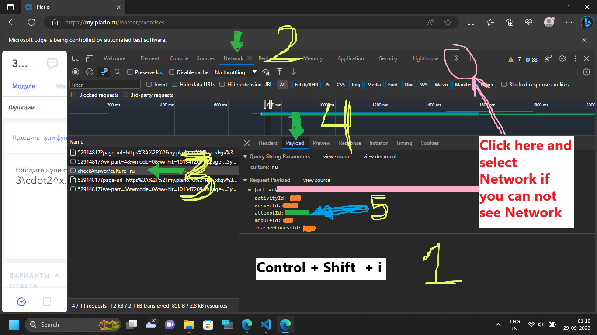

## Plario Automate All Tasks

#### It uses Microsoft Edge as the webdriver, if you want to use other that this, configure it accordingly.

### Steps:
1. Install dependencies
```python
pip install -r requirements.txt
```

2. Open plario and go to the `network tab`. Find `attempId` in under the payload of /api/adaptiveLearning/checkAnswer/ 



3. Put your credentials in the file `.env`. put Email, Attempt ID and  Password in respected field.
```python
export ATTEMPT_ID = PUT_YOUR_ATTEMPT_ID_FROM_THE_NETWORK_TAB
export EMAIL = YOUR_TSU_ACCOUNT_EMAIL_ADDRESS
export PASSWORD = YOUR_TSU_ACCOUNT_PASSWORD
export COURSE_URL = MOODLE_COURSE_URL_WITH_PLARIO_LINK
```

4. Run the script
```python
python plario.py
```

5. If you have any problem try these steps:
```
1. Refresh the page
2. Restart again
3. Check for credentials
4. Select the module by yourself
```

```
I do not suggest or support using this. I wrote this code entirely for learning purposes only. 
Only you will be responsible if you use this script.
```